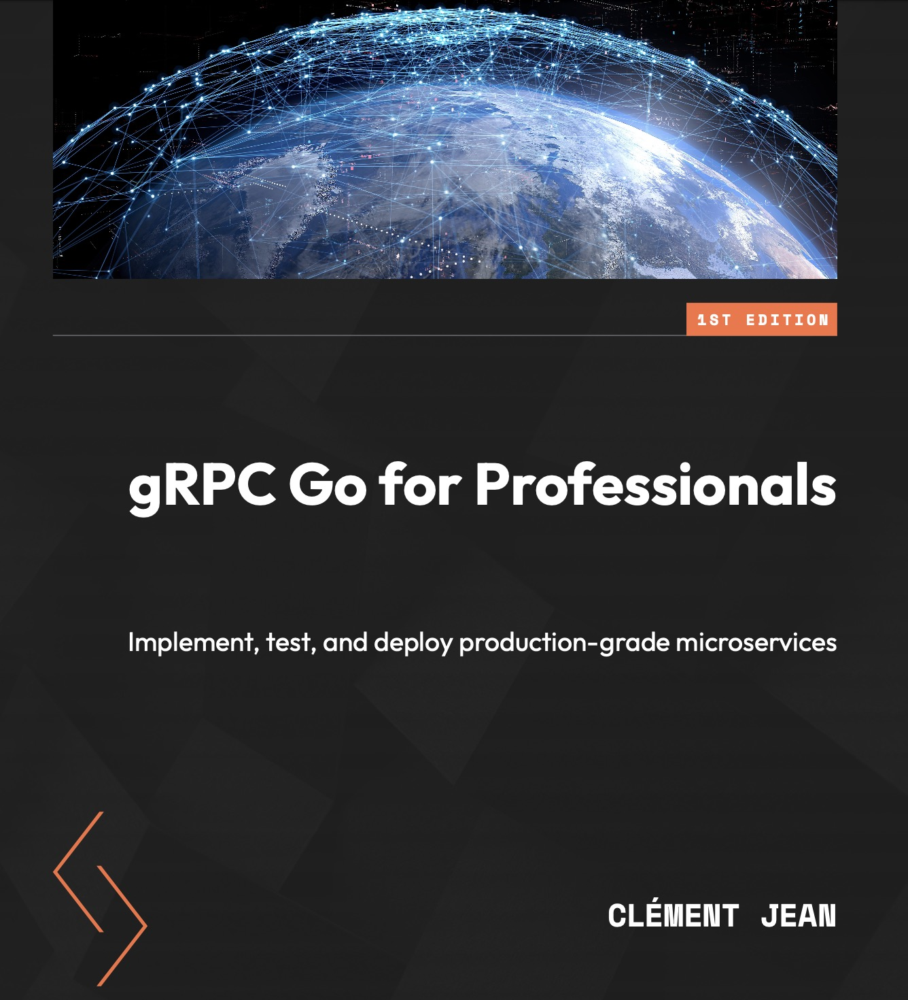

# gRPC Go for Professionals

## Outline

* [Chapter 1 - Networking Primer](chapter1)
* [Chapter 2 - Protobuf Primer](chapter2)
* [Chapter 3 - Introduction to gRPC](chapter3)
* [Chapter 4 - Setting up a Project](chapter4)
* [Chapter 5 - Types of gRPC Endpoints](chapter5)
* [Chapter 6 - Designing Effective APIs](chapter6)
* [Chapter 7 - Out-of-the-box features](chapter7)
* [Chapter 8 - More Essential Features](chapter8)
* [Chapter 9 - Production-grade APIs](chapter9)

## Description

In recent years, the popularity of microservice architecture has surged, bringing forth a new set of requirements. Among these, efficient communication between different services takes center stage, and that’s where gRPC shines. This book will take you through creating gRPC servers and clients in an efficient, secure, and scalable way. However, communication is just one aspect of microservices, so this book goes beyond that to show you how to deploy your application on Kubernetes and configure other tools that are needed for making your application more resilient. With these tools at your disposal, you’ll be ready to get started with using gRPC in a microservice architecture.

In gRPC Go for Professionals, you’ll explore core concepts such as message transmission and the role of Protobuf in serialization and deserialization. Through a step-by-step implementation of a TODO list API, you’ll see the different features of gRPC in action. You’ll then learn different approaches for testing your services and debug your API endpoints. Finally, you’ll get to grips with deploying application services via Docker images and Kubernetes.

## What you will Learn

- Understand the different API endpoints that gRPC lets you write
- Discover the essential considerations when writing your Protobuf files
- Compile Protobuf code with protoc, Buf, and Bazel for efficient development
- Gain insights into how advanced gRPC concepts work
- Grasp techniques for unit testing and load testing your API
- Get to grips with deploying your microservices with Docker and Kubernetes
- Discover tools to write secure and efficient gRPC code

## Contributing

There main ways in which you can contribute are the following:

- Correcting/Adding documentation (in or out the code).
- Ask questions or provide feedback in the Issues.
- Propose changes in the Pull Requests (note that, in order to stay consistent with the book, PR will only be accepted for future version of the book).